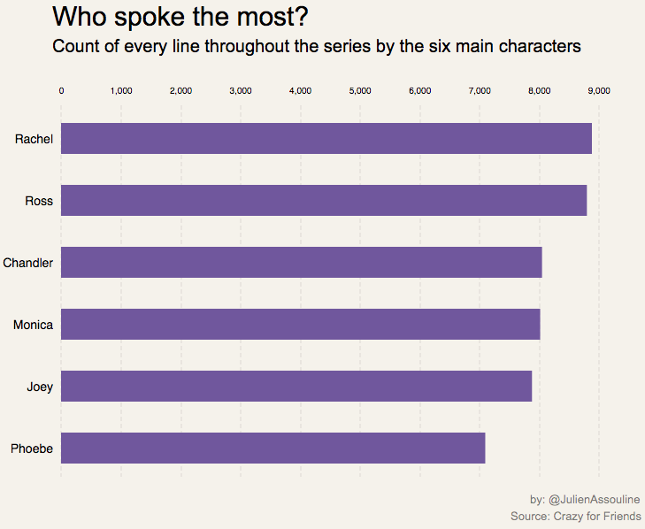

---

title: Analyzing every line from "Friends"

---

# Visualizing all of the dialogue from "Friends"

Pedestrian fatalities in New York keep dropping. In 2016, there were only 181 pedestrian deaths, which is lower than 2015 which saw 197 pedestrian fatalities.

"Friends" was known for many things. It's humor. The love affairs between the characters. Central Perk, youth, style, but perhaps most notably, the relationship of the six major characters; Rachel, Ross, Monica, Chandler, Joey, and Phoebe. Each with their different personalities and quirks that melded oh so well together. 

But, while each had great chemistry. Some characters, friends, spent more time and interacted more with others. 

One way of measuring this is to look at how often each character mentioned the other, as can be seen in the chart above. 

This brings us some insight. Ross and Rachel for example, both mentioned each other more than any other character. Which makes a ton of sense because so much of the plotline and show is dominated by their on again off again relationship. It ended with them finally getting together in the final episode of the show, but it certainly wasn't without a lot of drama, where each character was probably shouting each other's names with love and anger. 

Monica and Chandler also mentioned each other more times than any other character. While they both didn't start out as lovers, once they did fall in love, it was good. In many ways, they probably had the strongest relationship out of anyone in the friend group. Yes, even stronger than the bond between Chandler and Joey. Joey was second on Chandlers most mentioned list, and second by a wide margin, giving a good sense of who Chandler was closest with among the six characters. 

Joey was very close with the "boys". Especially Chandler, but surprisingly, he mentioned Ross more than he did Chandler throughout the series. Out of the girls, he mentioned Rachel the most, which makes sense considering that they were roommates for a few seasons. 

Phoebe's mentions, on the other hand, are a lot more scattered. She does mention Monica the most but not by that much. She was, after all, the enigma of the group. She wasn't related to any other character. She didn't fall in love with anyone in the group, and she wasn't anyone's roommate. Well, apart from Rachel for a short stint in season 6. 

Throughout the show, Rachel, and Ross had the most lines, out of the six main characters. 

In some ways, this helps bring a type of hierarchy to the show. Even though all of these characters were in every single episode, some of them seemed to be a little more important than others. Or whose, roles were more important. 

Ross and Rachel especially. While characters such as Joey and Phoebe certainly played a pivotal part in the show. Their story lines rarely drove the show. Usually, the final cliff hanger of the seasons had to do with some drama between Ross and Rachel. Or it involved some big romantic moment between Monica and Chandler. 

But, we can also see, if some characters gained or lost dialogue or some importance in the show.

Rachel, for example, didn't necessarily start out with the most dialogue, but by season 8, she had taken over the biggest share of the dialogue by a good margin. This was the season where she was pregnant with Rosse's baby. 

Ross, on the other hand, dominated a good part of the show's dialogue for the first three seasons, but then dropped off quickly, before regaining that most of the dialogue near the end of the series. 

In the end, though, the main six character's dialogue primarily hovered around 15 to 20 percent. And, even though there were other characters who appeared on the show. None of them even came close to having the same importance. 

