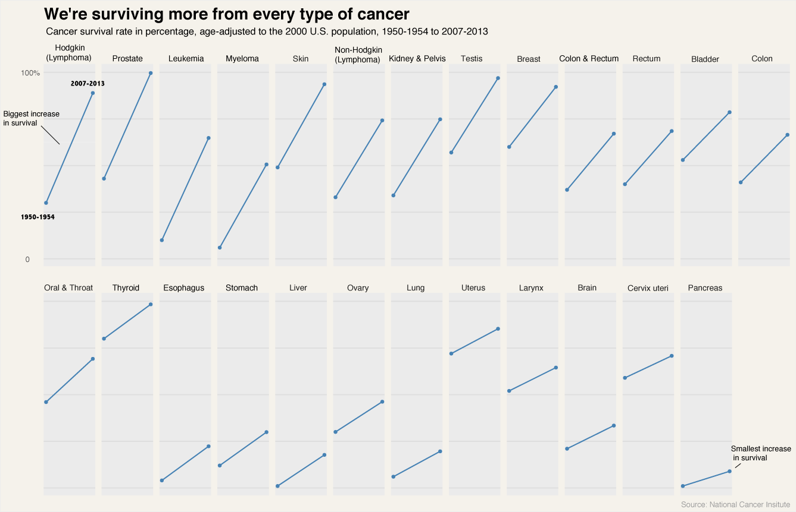
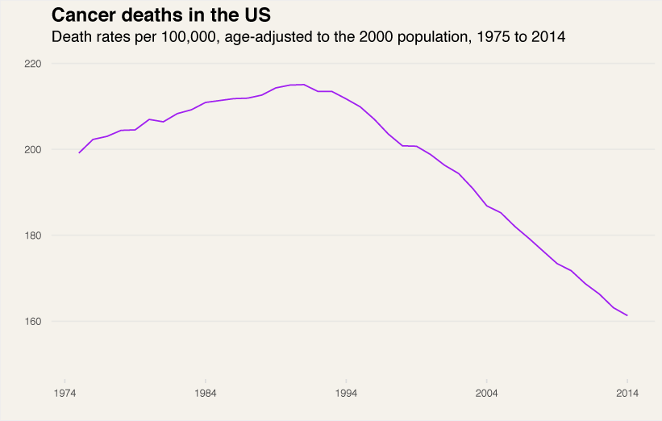
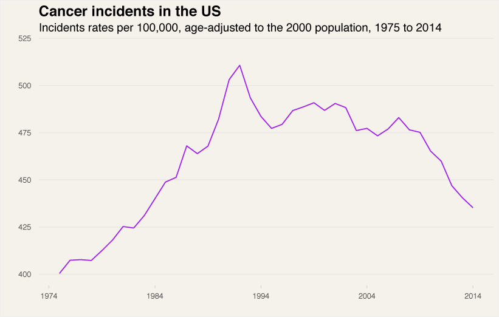

---

title: We're Dying Less From Cancer
layout: project

---

# We're Dying Less From Cancer

Pedestrian fatalities in New York keep dropping. In 2016, there were only 181 pedestrian deaths, which is lower than 2015 which saw 197 pedestrian fatalities.

Overall, since 2013, when pedestrian deaths hit a soaring spike, New York pedestrian deaths have been steeply trending downwards.

This is the lowest it's been since De Blasio took office in 2014. De Blasio has made it his mission to reduce and eliminate traffic deaths in New York with his Vision Zero plan, and thus far it's been going well.

But, the number of pedestrian fatalities isn't the only element of note, as pedestrian injuries have been steadily trending downwards since 2010.

.gif)

In this regard, 2016 was also a new low, as around 15 thousand pedestrians were injured in the city.

The Vision Zero plan has made it so that the "city lowered its default speed limit to 25 miles per hour, from 30 m.p.h., and increased enforcement of speeding laws, among other initiatives."

New York can in fact now, claim that it is one of the safest big cities in America for pedestrians.

In 2015 they had the 9th lowest rate of pedestrian fatalities among US cities with at least a population of 500,000.

This overall is good news for New York, but the US as a whole is trending in the wrong direction.

Since 2009 pedestrian fatalities have been on a steep rise. It's difficult to answer the question of why this is happening, and alcohol doesn't seem to be a factor.

In fact, there is no relationship between the number of pedestrian fatalities, and the driver or the pedestrians alcohol level.

What is startling is the immense gap between the men and women fatalities.
 
Male pedestrians get killed more often than women, and at every age level. From the 0-4 age group until the 15-19 age group, there isn't a huge divide between their fatalities. What is interesting is that afterward, the divide becomes exponentially more pronounced, and never comes back to those early ages.

The complexity here is that this doesn't mean that men are more likely to be hit by cars. What it does mean is that they are more likely to die after they are struck.

There are a number of reasons why this could be happening, such as men being more likely to engage in risky behaviors when crossing the street. This can be jaywalking or trying to cross streets with higher speed limits. These, of course, are just hypotheses and more studies need to be done in order to find out the cause of this event.

But, the US may want to invest more into this research, as lowering the number of male pedestrian deaths will certainly help stop the rising trend of pedestrians dying in the US.