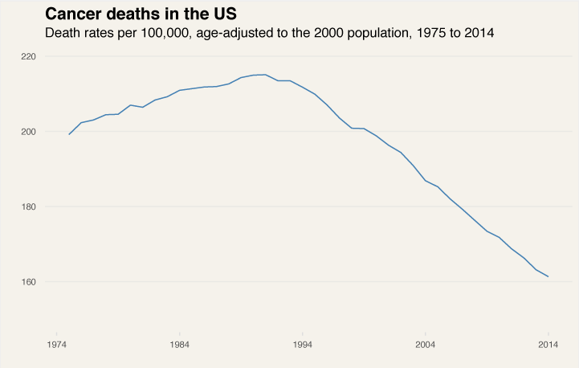

---

title: We're Dying Less From Cancer
layout: project

---

# We're Dying Less From Cancer

Just about everyone has been affected by cancer in some shape or form. Whether it's by being diagnosed with the disease or having lost a loved one. Cancer remains a prevalent force in our society. Every year it affects thousands of Americans. In fact, in 2015, according to the <a href = "https://www.cdc.gov/">CDC</a> (Center for Disease Control and Prevention), cancer was the second leading cause of death in the United States. 

Heart disease is the biggest cause of death in the US, but cancer is a close second, and both causes tower over any other cause. 

That said, with regards to cancer, there's been a ton of improvement over the years. In fact, our likelihood of surviving cancer has dramatically increased. 

This isn't just on an average basis case. We are more likely to survive every type of cancer than before. 

One of the major breakthroughs was the development of <a href = "https://www.asco.org/research-progress/cancer-progress/top-5-advances-modern-oncology/chemotherapy-cures-hodgkin-lymphoma">four chemotherapy drugs</a> - mechlorethamine, vincristine (Oncovin), procarbazine and prednisone - in the 1970s, which has paved the way for Hodgkin lymphoma survivability rates of near 90 percent. 

Leukemia, which was once one of the deadliest types of cancer, with a survivability rate of only 10 percent has also seen major breakthroughs and now has a survivability rate of 65 percent. The big breakthrough with Leukemia was with the chemotherapy medication <a href = "https://www.asco.org/research-progress/cancer-progress/top-5-advances-modern-oncology/targeted-drug-transforms-treatment">Imatinib</a>, which has turned a life expectancy of only three to five years, into a long term condition with daily pill intake. 

Some types of cancers have also been helped by the activism around it. One of the most prominent examples is with breast cancer, which has its own awareness month in October. Breast cancer touches around one in eight women, according to the <a href = "http://www.nationalbreastcancer.org/">National Breast Cancer Foundation</a>. Breast cancers have seen many <a href = "http://www.healthline.com/health/history-of-breast-cancer#early-discovery2">breakthroughs</a>, and new drugs implemented to fight the disease, and now, it has a survivability rate of 92 percent, which is the 5th highest rate of survival among any type of cancer.  

Other cancer types, however, have seen little improvements, and are still very difficult to treat. The one which has seen the least improvement and still, the most difficult to treat is Pancreatic cancer. It is an <a href = "https://www.cancer.org/cancer/pancreatic-cancer.html">aggressive form of cancer</a> and has very few symptoms until it is advanced which makes it difficult to treat. 

In general, though, fewer people are dying from cancer every year. Since it's peak in 1991 the rate of cancer deaths in the US has dropped by 25 percent. 

The number of people who are getting diagnosed with cancer has also been dropping, which could be signaling a greater awareness of the causes of cancer. 

But, the rate at which we are getting diagnosed with cancer isn't dropping as precipitously as the rate of cancer deaths, which further signals that we are getting better at treating cancer, as the rate of survivability keeps rising. 